# Project Portfolio 2 - Rock Paper Scissors Lizard Spock
## An interactive game based off the variation from the Big Bang Theory 
### PP2 - Amy Rixon - 28/05/2024

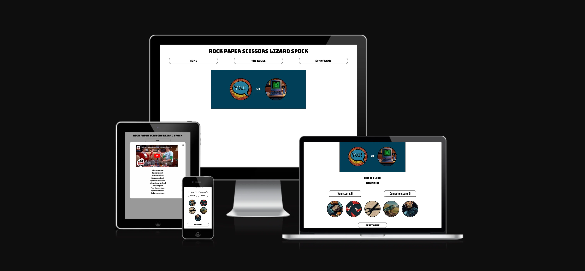

## **[Live Site](https://noxiryma.github.io/pp2_js_rpsls/)**
## **[Repository](https://github.com/noxiryma/pp2_js_rpsls)**

## [ Table of contents ](#table-of-contents)

1. [ About ](#about)
2. [ Features ](#features)  
3. [ Features Left to Implement ](#left)  
4. [ Technology used ](#tech) 
5. [ Testing ](#testing)  
6. [ Deployment ](#deployment)
7. [ Bugs ](#bugs)  
8. [ Credits, Content and Resources](#credits)
9. [ Acknowledgements](#acknowledgements)  

## About 

This website is part of my second portfolio project for the Code Institute's Full Stack Software Developer Diploma. The required main
technologies for this project were:

- HTML
- CSS
- Javascript

I chose to create a site using the Project Portfolio example 1 in which the brief was to build a Rock, Paper, Scissors, Lizard, Spock
game. The game was to involve a game of chance by the user being put up against a computer. 

The project requirements were to include: 

- Pattern matching functionality
- A limited number of tries before the game is over
- A score tracking system
- The ability to play against the computer

The design of the website was one that I wanted to kept quite simple so it was easy for the user to navigate. I also wanted to pay homage to The Big Bang Theory by creating a comic book style presentation a reference to the t-shirts that Sheldon was famous for wearing. I also looked to old style arcade games such as Space Invaders and Pac Man as influence on the styles of font used. 

### Colour Scheme 

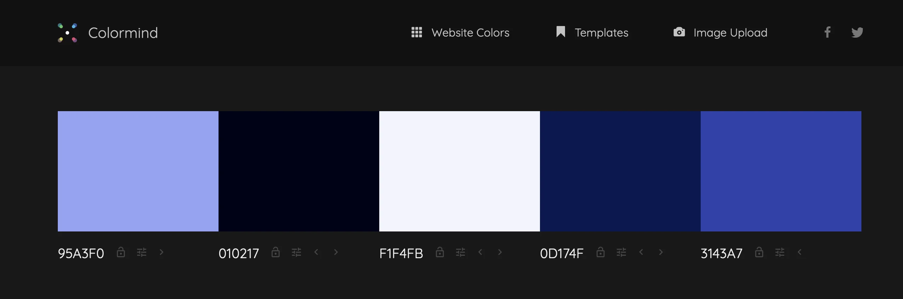

The colour scheme I decided to focus on was a minimalist approach to the colours found in a majority of the images selected for this 
website. I focussed on the blue tone of Spock's smock to build the base of colour choice for this project rather than using clashing
colours. 

### Font 

The font family used for this site is 

### "Bungee", sans-serif 

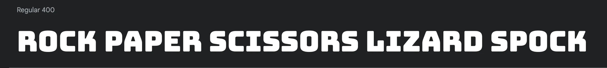

with a weight of 400 the font is easy to read and prints the text on the page in all capital letters. Much like old arcade games. 

For the rest of the content outside of h1 to h6 and the buttons. I used a different font called 

### "Teko", sans-serif;

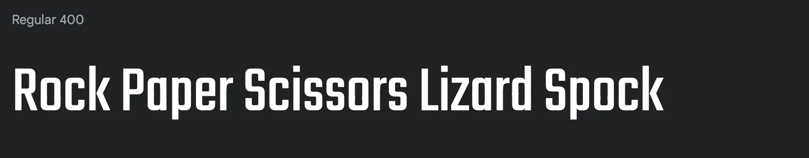

The font was chosen for it’s accessibility as well as it’s design. The text is clear to read with lowercase and uppercase whilst also sitting with a similar style to Bungee. 

### Return to table of contents 

## FEATURES

### Home Page
The website has 4 different pages presented to the user. 

The first being the home page. This is the landing page for the site and displays the title of the game and the site at the top in clear bold writing. There are then 3 buttons displayed for the user to navigate. Home, The Rules and Start Game. 

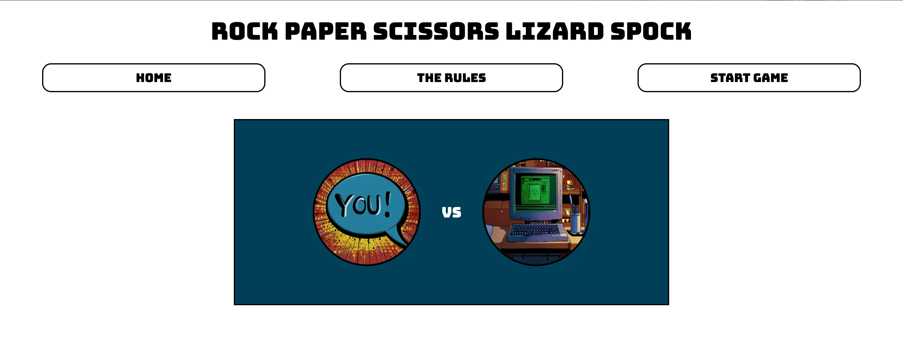

### Navigation Buttons
As the user hovers over the buttons with a mouse they change colour to highlight this is the one they are about to select. I styled the buttons in CSS and added rounded corners to them to create a pleasant and modern appearance rather than a harsh box. 

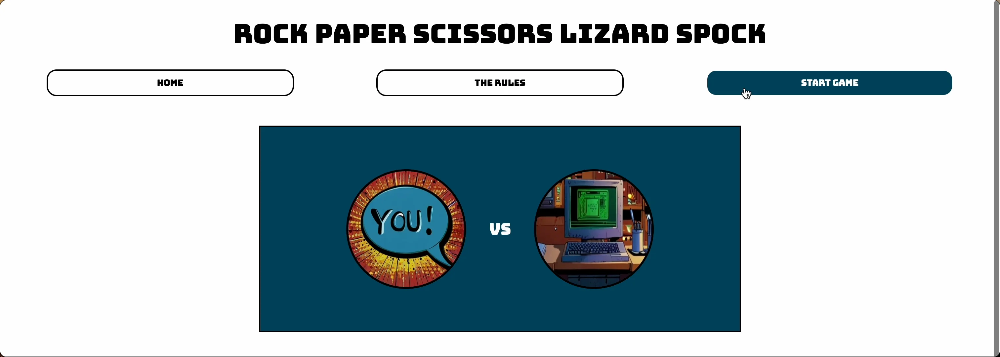

I placed the navigation buttons in order from left to right as to how the user should navigate through them. First clicking on the rules button to learn the rules of the game. Then clicking on the start game button to start the game. 

On smaller screens from 320px up to 768px the navigation buttons flex direction were changed from row to column. 

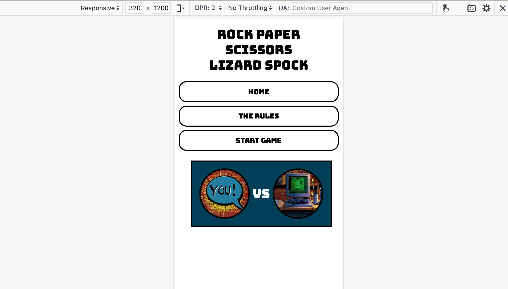

For mobile phones from 320px to 480px I did consider adding in a burger menu but wanted to reduce the number of clicks on the website for the user to start playing the game. I felt that centering, increasing the width and adding a margin in between the buttons would still make the navigation menu easy for the user to use whilst keeping a neat and smooth appearance. 

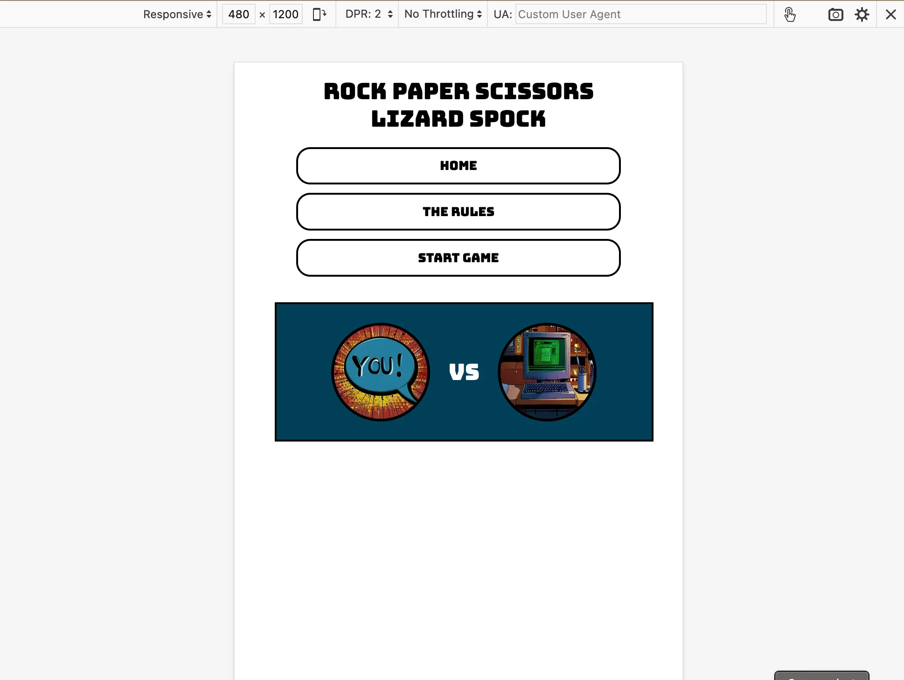

The navigation buttons on a 480px screen up to 1024px still take up a large width of the screen but it has been reduced with the width value changed using CSS so that the buttons sit just within the you vs computer box underneath. This I also felt kept in with the style of a button clicking game. 

### The Rules 

Upon clicking on the rules button a modal appears on the webpage with an embedded video of Sheldon explaining the rules of the game to the user. I also included a text transcript of the rules underneath the video in case there are any hard of hearing users for the game as they would not be able to read the subtitles of the video due to it's size on smaller screens. I added a start from and end video so that the rest of the content in the video which is not relevant to the game distracts from the object of learning the rules only. 

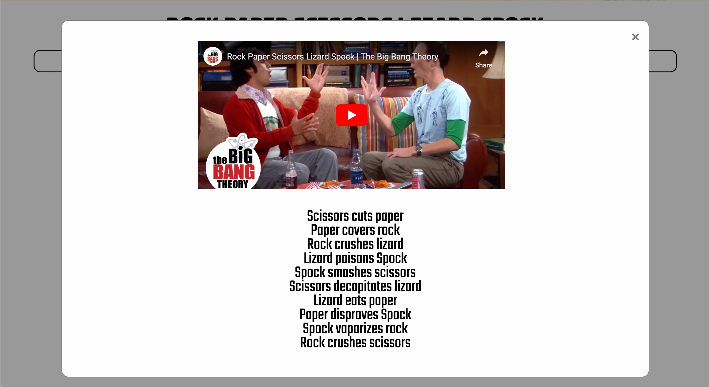

On smaller screens the video is adapted in size to fit the width and height of the modal using styling in CSS. 

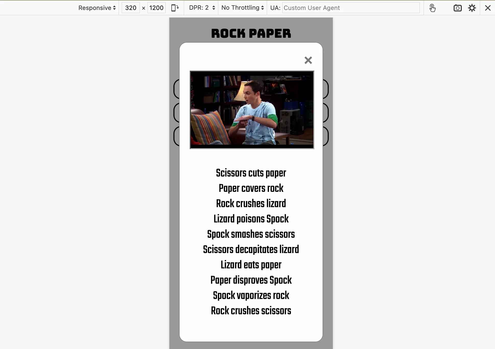

### Start Game 

The start game button then loads the game underneath the main box on the home page of the You vs Computer images. This was created using an onclick function in Javascript getting the elements of the home and game area by their ID and using the display function. The user can navigate away from the game page by clicking the home button again.

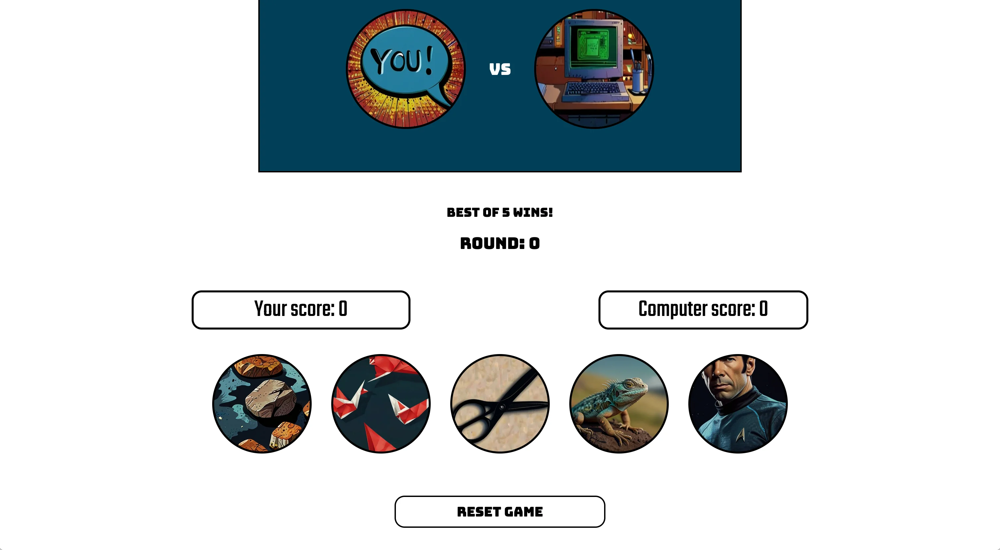

I decided to include this function after initially creating the game page as an external game.html file and looking at other example game websites I realised it was cleaner and would allow me to use more Javascript features to have everything on one page. I also wanted the home page to look clean and not messy with the game underneath. 

### Rounds 

When the game first loads the round number is set to 0 and the user is informed that best of 5 games wins. As the user plays the round numbers increase with a result text declaring if the user has won, lost or drawn with the computer. The user score and the computer score is also updated as the rounds are played. Both of these features were written in Javascript using the increment and identifying the start numbers as zero. 

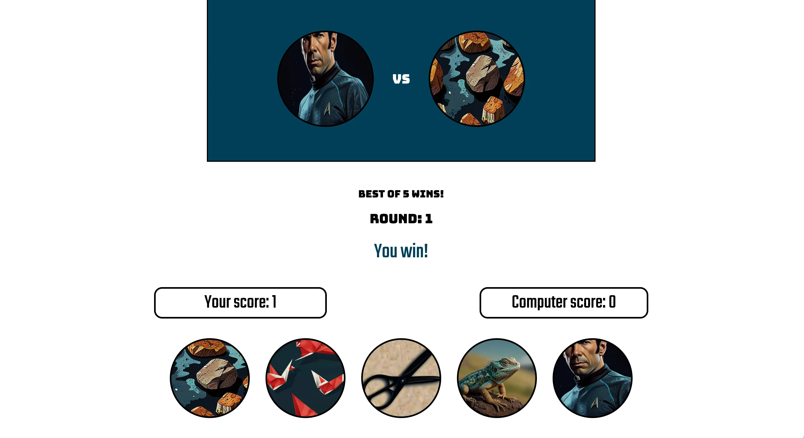

### Game Buttons 

The game buttons are styled to match the You vs Computer images using CSS and are written as buttons in HTML. Event listeneres were added for each button with an onclick event being to start the game with the runGame function in Javascript. Each button also has a hover feature where the cursor changes to a pointer and the border changes from black to white. This was styled in CSS. 

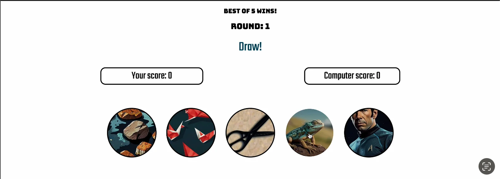

### End Game 

The game runs for a number of 5 rounds. The winner is declared using a result variable in Javascript which displays to the user one of three statements based on the result of the scores of the 5 rounds. To prevent the user from being able to play the game any further than 5 rounds I used display and getElementById in Javascript in the endGame function to remove the game buttons from the page. This makes the game result and reset game button display clearly to the user. 

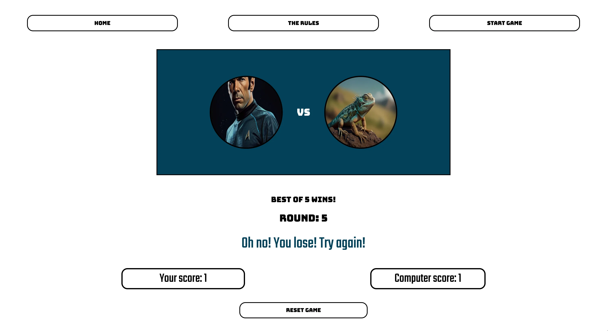

### Reset Game 

The reset game button sets all the values back to 0 on the screen and brings the game buttons back onto the page. It also resets the You vs Computer images back to their original, not letting the user get confused as if they have already selected an option. 

### User vs Computer images 

The You vs Computer section starts with an identifying image of each player. The You being a comic book style speech bubble and the Computer being the image of a vintage computer. The images were given the same styling of the buttons that the player selects below this section. 

The images display what each player has selected for each round. This is done in Javascript using playerImage.src and computerImage.src  in the runGame function. The images then reset back to the You and Computer images when the user hits the reset button.

### Mobile & Smaller Screen styling 

For the mobile styling the display of the buttons was organised in CSS using flex and margin to place the buttons in my desired layout. Giving the user enough space to not accidentally click the wrong button for their turn and to still have them readable for their images. Whilst I am happy with the design I do worry about how clearly it is to identify the selection because of how small the buttons are on the screen on 320px to 768px screens. 

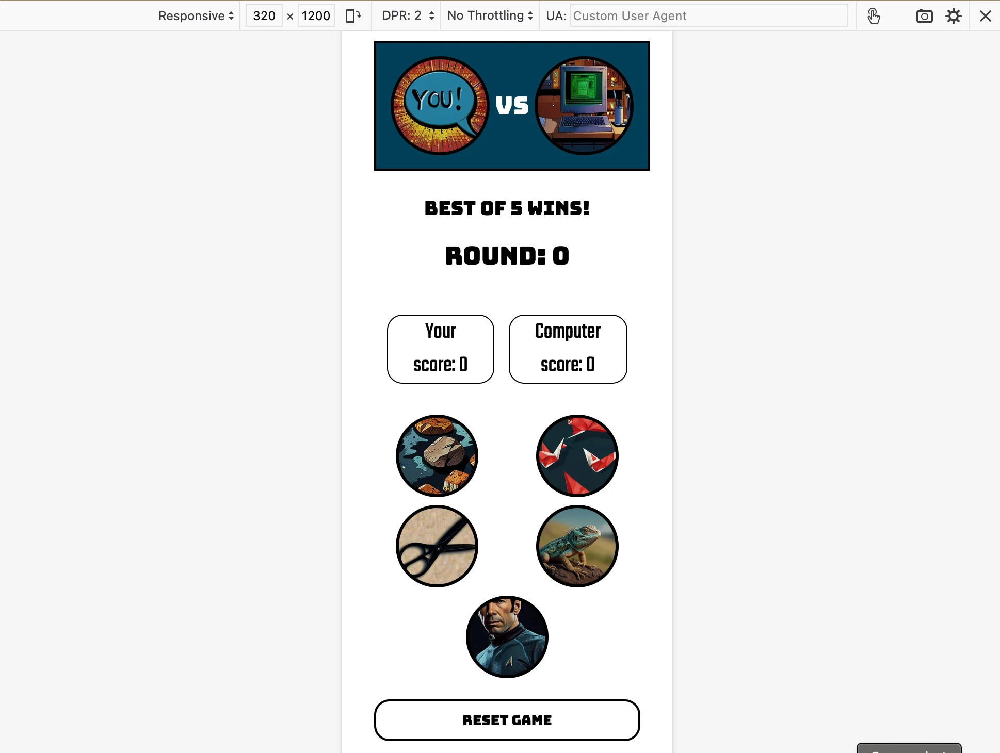

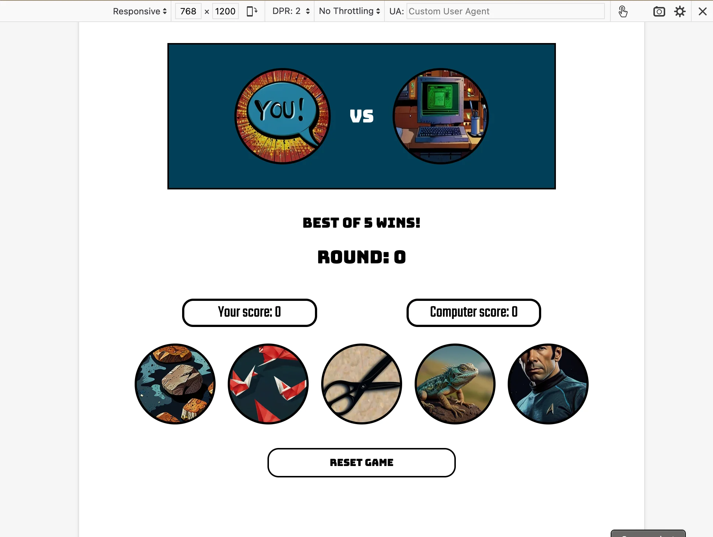

## Features left to implement

- A hover over feature for the button selection with the title of the choice the user is about to make
- A best of 3 games result so the user is encouraged to stay on the page longer
- For the video to end when clicked out of the modal rather than for it to keep playing in the background 
- For more than one player to be able to compete. This could be another button for the user to press which links with another person to play against on the game.  

### Technology used  

### HTML

Used to build the structure of the web page. 

### CSS 

To style the website across multiple media screens

### Javascript 

- Used to create functions to run the game, end the game and reset the game. 
- Onclick events used to display content of the page. 
- Event listeners used for user activity. 
- Incrementation used for increasing the user, computer and number of rounds played. 
- Random number and case used for computer selection. 
- Text content used to display the result, user, computer and round number. 

### Googlefonts

For the selection and use of a font style for the website. 

### Pixelied 

Used to convert png files to webp files for images used. 

### Leonardo.ai 

An AI image generation website 

### JS Hint 

Used for validating Javascript. 

### W3 Validator 

Used for validating HTML and CSS

## Testing 

**Testing for links and form** 

| Test | Outcome |
|--|--|
| All navigation buttons are correct | Yes |
| All buttons select correct user choice | Yes |
| All scores are recorded correctly (win = user + 1, lose = computer +1, draw = 0)| Yes |
| Rounds increment correctly | Yes|
| Modal opens on button click and user has to play video | Yes |
| Modal closes when clicked on 'x' or anywhere on screen | Yes |
| Reset game button sets all values to 0 and correct images in You vs Computer section | Yes | 

**Testing for responsiveness**
| Test | Outcome |
|--|--|
|Home, The Rules and Start Game pages all display correctly on screens smaller than 768px | Yes |
|Home, The Rules and Start Game pages all display correctly on screens bigger than 768px | Yes |

## HTML Validation Testing 

No errors were presented upon final testing in [HTML validator](https://validator.w3.org/). 

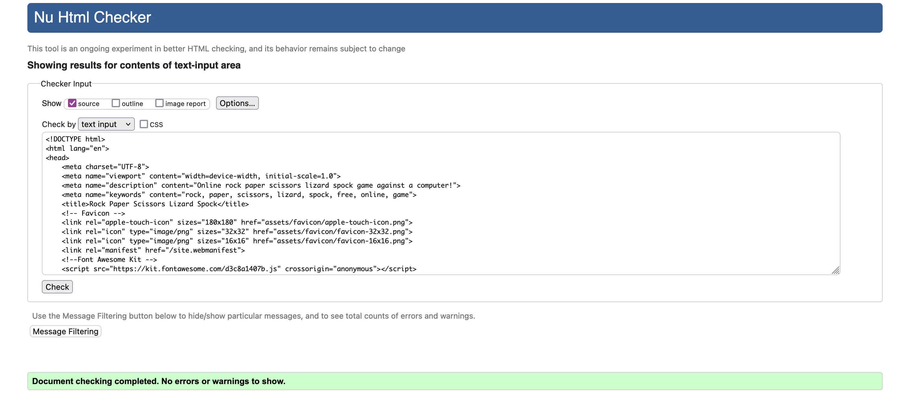

## CSS Validation Testing 

No errors were presented upon final testing in [CSS Validator](https://jigsaw.w3.org/css-validator/)

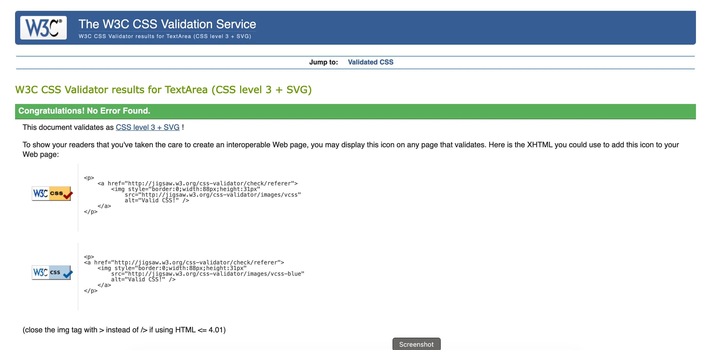

## Javascript Validation Testing 

JS Validator display two unused variables but these are used in html only. 
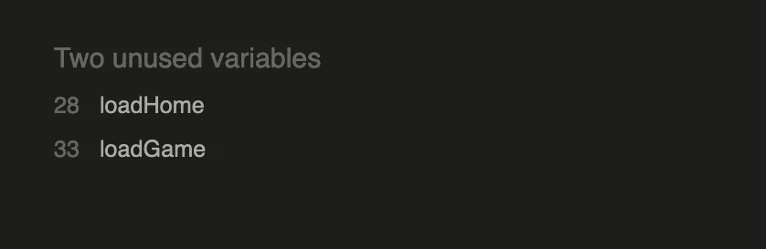

Otherwise no errors were presented upon final testing.
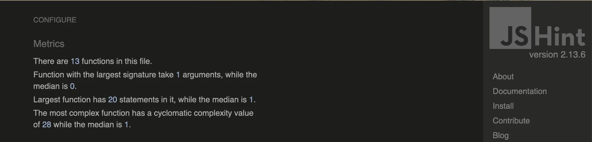

## Google Lighthouse Testing 

The results of Google Lighthouse Test on Mobile

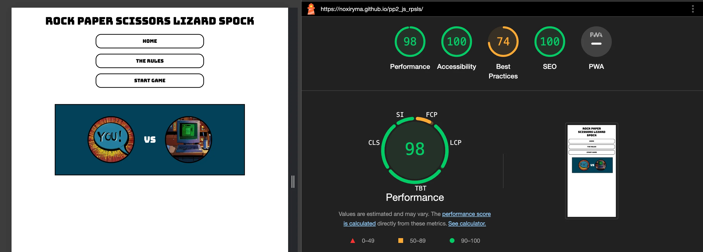

The results of Google Lighthouse Test on Desktop 

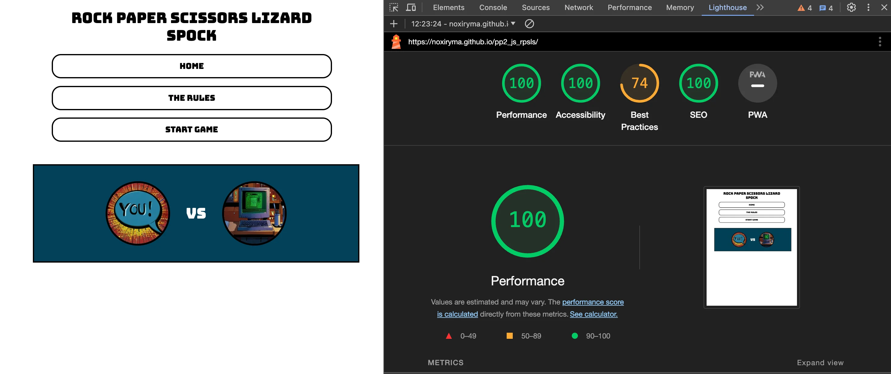

## Deployment 

I deployed the project to GitHub pages using the following steps:

+ In the GitHub repository, navigate to the Settings tab
+ From the source section drop-down menu, select the Master Branch
+ Once the master branch has been selected, the page will be automatically refreshed with a detailed ribbon display to indicate the successful deployment.

The live link can be found here: 

## Bugs  

| Bug | Fixed |
|--|--|
| On clicking the rock button round incremented by two. Removed onclick in html.| Yes |
| Rounds do not total to 5. Changed total rounds value to 6 in JS | Yes |
| Rounds continue to increment past 5. Removed game button area in endGame function to prevent user from conitnuing to play | Yes |
| You vs Computer images did not reset to original on resetGame function | Yes |

## Credits, Content & Resources 

### [w3 schools](https://www.w3schools.com/)

Used for general tips and instructions on writing HTML, CSS and Javascript. 

### [Code Institute](https://codeinstitute.net/full-stack-software-development-diploma/?utm_term=code%20institute&utm_campaign=CI%2B-%2BUK%2B-%2BSearch%2B-%2BBrand&utm_source=adwords&utm_medium=ppc&hsa_acc=8983321581&hsa_cam=1578649861&hsa_grp=62188641240&hsa_ad=635720257674&hsa_src=g&hsa_tgt=kwd-319867646331&hsa_kw=code%20institute&hsa_mt=e&hsa_net=adwords&hsa_ver=3&gad_source=1&gclid=EAIaIQobChMIysPPieLJhQMVl5VQBh2ZVQSEEAAYASAAEgJOn_D_BwE&nab=1&utm_referrer=https%3A%2F%2Fwww.google.com%2F) 

### [Favicon](https://favicon.io/favicon-converter/)

The converter was used to create the icon for the website. 

### [Google Fonts](https://fonts.google.com/specimen/Bungee?query=bungee)

Font selected for website was taken from Google Fonts website. 

## Images

All images apart from the icon were generated on Leaonardo.ai website.

## Icon 

 converter was used to transform the below icon into a usable icon for the website. 

## Acknowledgements 

### Alan Bushell 

Appointed as my mentor for my diploma. Alan gave me valuable feedback and answered every question that I had whilst giving encouragement and introduced me to a number of resources that I will use throughout my software career.